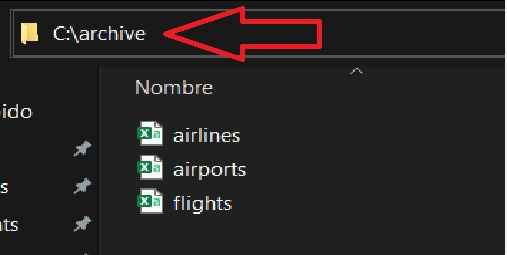
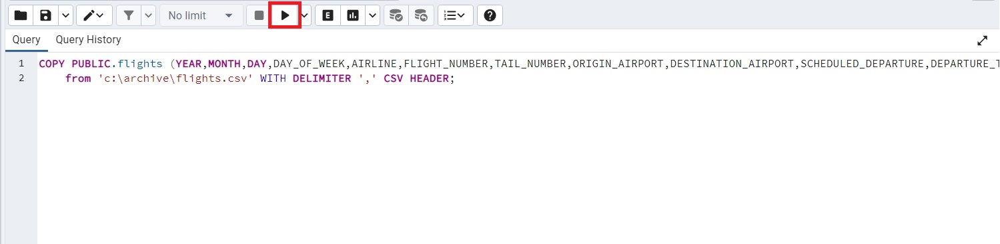
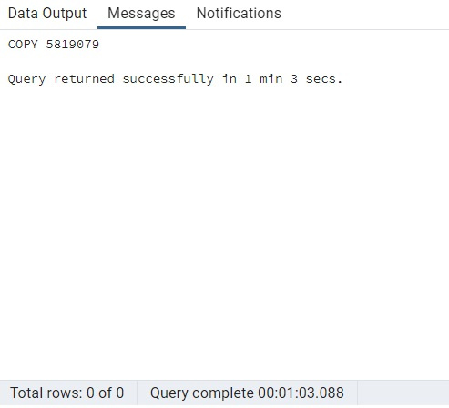

# Prueba técnica - BACKEND - Suma Wealth

---

## Objetivos del Proyecto

- Desarrollar una API en Node.js que permita crear, actualice, elimine y obtenga los datos sobre aeropuertos, aerolíneas y vuelos proporcionados.
- La API debe tener documentación sobre cómo usarla como si estuviera entregando esta API a und desarrollador front-end.
- Integrar con una base de datos PostgreSQL y construir seeders para poblar la base de datos con los datos proporcionados.

## Comenzando

1.  Forkear el repositorio para tener una copia del mismo en sus cuentas
2.  Clonar el repositorio en sus computadoras para comenzar a trabajar

Tendrán un `boilerplate` con la estructura general del servidor.

3.  En la carpeta raiz crear un archivo llamado: `.env` que tenga la siguiente forma:

```env
DB_USER=usuariodepostgres
DB_PASSWORD=passwordDePostgres
DB_HOST=localhost
DB_NAME=airline
```

Reemplazar `usuariodepostgres` y `passwordDePostgres` con tus propias credenciales para conectarte a postgres. Este archivo va ser ignorado en la subida a github, ya que contiene información sensible (las credenciales).

Adicionalmente será necesario crear desde psql una base de datos llamada `airline`

4.  Instrucciones para iniciar:

- Instalar dependecias ingresando en nuestro terminal el comando:

```bash
npm install
```

- Inicializar ingresando el comando:

```bash
npm start
```

3.  Una vez inicializado se cargaran automaticamente los aeropuertos y las aerolineas en la base de datos.
    Por el gran tamaño del archivo de datos de vuelos ("flights.csv") adjunto en el correo electronico se debera cargar manualmente de la siguiente manera:

    A- Dentro de la interfaz grafica de postgresSQL "pgAdmin 4", accedemos a las tablas ya creadas dentro de la base de datos(airline -> Schemas -> Tables)<p align="left"><p>

    B- Nos situamos sobre la tabla "fligths" y hacemos click derecho clickeando "query tool" en el menu que se nos despiega<p align="left"><p>

    C- ingresamos el siguiente script:

    ```
    COPY PUBLIC.flights (YEAR,MONTH,DAY,DAY_OF_WEEK,AIRLINE,FLIGHT_NUMBER,TAIL_NUMBER,ORIGIN_AIRPORT,DESTINATION_AIRPORT,SCHEDULED_DEPARTURE,DEPARTURE_TIME,DEPARTURE_DELAY,TAXI_OUT,WHEELS_OFF,SCHEDULED_TIME,ELAPSED_TIME,AIR_TIME,DISTANCE,WHEELS_ON,TAXI_IN,SCHEDULED_ARRIVAL,ARRIVAL_TIME,ARRIVAL_DELAY,DIVERTED,CANCELLED,CANCELLATION_REASON,AIR_SYSTEM_DELAY,SECURITY_DELAY,AIRLINE_DELAY,LATE_AIRCRAFT_DELAY,WEATHER_DELAY)

    from 'C:\\TU_RUTA\flights.csv' WITH DELIMITER ',' CSV HEADER;
    ```

    > **IMPORTANTE:** Reemplazar `TU_RUTA` por la ruta donde tengas guardado el archivo `flights.csv`

    <p align="left"><p>

    D- Quedandonos como en la imagen:<p align="left"><p>
    clickeamos el boton de "play" remarcado en rojo, en la parte inferior veremos un contador, una vez que finalize tendremos cargados los datos de los vuelos en la base de datos. Si todo salio correctamente deberiamos visualizar un mensaje como el siguiente:<p align="left"><p>

---

# Endpoints/Flags que pueden utilizar:

#### AIRLINES

- GET <b style="color:white">/airlines</b> --> pedir todas las aerolineas de la base de datos.
- GET <b style="color:white">/airlines/{id}</b> --> pedir aerolinea particular mediante un ID proporcionado por params.
- GET <b style="color:white">/flights/airlines?name={nombre}</b> --> pedir aerolinea mediante un nombre específico. Pasar nombre por query con el `'key': 'name'`.(ej: `http://localhost:3001/airlines?name=Alaska Airlines Inc`).

- POST <b style="color:white">/airlines</b> --> Crear una nueva aerolinea. Pasar por por el cuerpo de la petición (request.body) los siguientes parametros:

  ```bash
  {
    "iata_code":"AA",
    "airline":"Aerolinea de ejemplo"
  }
  ```

- PUT <b style="color:white">/airlines/{id}</b> --> Modificar una aerolinia particular mediante un ID proporcionado por params, y los mismos parametros que queramos modificar por el cuerpo de la petición (request.body) al igual que el `'POST'`.

- DELETE <b style="color:white">/airlines/{id}</b> --> Borrar una aerolinia particular mediante un ID proporcionado por params.

#### AIRPORTS

- GET <b style="color:white">/airports</b> --> pedir todos los aeropuertos de la base de datos.
- GET <b style="color:white">/airports/{id}</b> --> pedir aeropuerto particular mediante un ID proporcionado por params.

- GET <b style="color:white">/airports?name={nombre}</b> --> pedir aeropuertos mediante un nombre específico. Pasar nombre por 'query' con el `'key': 'name'`.(ej: `http://localhost:3001/airports?name=Southwest Georgia Regional Airport`).
- GET <b style="color:white">/airports?city={ciudad}</b> --> pedir aeropuertos pertenecientes a una ciudad particular. Pasar el nombre de la ciudad por 'query' con el `'key': 'city'`.(ej: `http://localhost:3001/airports?city=Aberdeen`).
- GET <b style="color:white">/airports?country={pais}</b> --> pedir aeropuertos pertenecientes a un pais particular. Pasar las siglas del pais por 'query' con el `'key': 'country'`.(ej: `http://localhost:3001/airports?country=usa`).

- POST <b style="color:white">/airports</b> --> Crear un nuevo aeropuerto. Pasar por por el cuerpo de la petición (request.body) los siguientes parametros:

  ```bash
  {
    "iata_code": "ABC",
    "airport": "Aeropuerto de ejemplo",
    "city": "Albany",
    "state": "GA",
    "country": "USA",
    "latitude": 31.53552,
    "longitude": -84.19447
  }
  ```

- PUT <b style="color:white">/airports/{id}</b> --> Modificar un aeropuerto particular mediante un ID proporcionado por params, y los mismos parametros que queramos modificar por el cuerpo de la petición (request.body) al igual que el `'POST'`.

- DELETE <b style="color:white">/airports/{id}</b> --> Borrar un aeropuerto particular mediante un ID proporcionado por 'params'.

#### FLIGHTS

- GET <b style="color:white">/flights?page=${page}</b> --> pedir todos los vuelos de la base de datos. Cada pedido envia 1000 vuelos, por lo tanto se le tendra que enviar la pagina deseada, inicializando por la 0 en la cual se mostraran los primeros 1000 ordenados por el id. Si no se le proporciona pagina (ej: <b style="color:white">/flights </b>) se mostrara automaticamente la pagina 0. En la consola del servidor se nos bridnara informacion, de la cantidad de vuelos en la base de datos, la cantidad de paginas disponibles y la pagina solicitada. Cabe destacar que la pagina se pasa por 'query', con el `'key': 'page'`.

- GET <b style="color:white">/flights/{id}</b> --> pedir vuelo particular mediante un ID proporcionado por 'params'.

- GET <b style="color:white">/flights?flight_number={flight number}</b> --> pedir todos los vuelos mediante un numero de vuelo específico. Pasar numero de vuelo por 'query' con el `'key': 'flight_number'`.(ej: `http://localhost:3001/flights?flight_number=22`).

- GET <b style="color:white">/flights?tail_number={flight number}</b> --> pedir todos los vuelos que incluyan un numero de cola específico proporcionado. Pasar número de cola por 'query' con el `'key': 'tail_number'`.(ej: `http://localhost:3001/flights?tail_number=N399HA`).

- POST <b style="color:white">/flights</b> --> Crear un nuevo vuelo. Pasar por por el cuerpo de la petición (request.body) los siguientes parametros:

  ```bash
  {
      "year": 2015,
      "month": 1,
      "day": 1,
      "day_of_week": 4,
      "airline": "AS",
      "flight_number": 98,
      "tail_number": "N407AS",
      "origin_airport": "ANC",
      "destination_airport": "SEA",
      "scheduled_departure": "0005",
      "departure_time": 2354,
      "departure_delay": -11,
      "taxi_out": 21,
      "wheels_off": "0015",
      "scheduled_time": 205,
      "elapsed_time": 194,
      "air_time": 169,
      "distance": 1448,
      "wheels_on": "0404",
      "taxi_in": 4,
      "scheduled_arrival": "0430",
      "arrival_time": "0408",
      "arrival_delay": -22,
      "diverted": 0,
      "cancelled": 0,
      "cancellation_reason": "",
      "air_system_delay": "",
      "security_delay": "",
      "airline_delay": "",
      "late_aircraft_delay": "",
      "weather_delay": ""
  }
  ```

- PUT <b style="color:white">/flights/{id}</b> --> Modificar un vuelo particular mediante un ID proporcionado por 'params', y los mismos parametros que queramos modificar por el cuerpo de la petición (request.body) al igual que el `'POST'`.

- DELETE <b style="color:white">/flights/{id}</b> --> Borrar un vuelo particular mediante un ID proporcionado por 'params'.
